  

Handle [ha(ː)n-dle] - A wordle with assembled Korean letters 

  English | <a href='./README.md'>한국어</a>

  <a href='https://github.com/wolimst/handle/actions/workflows/ci.yml'>
    </a
  >
  <a href='https://github.com/wolimst/handle/actions/workflows/deploy.yml'>
    </a
  >

## Handle (한들)

Handle \[ha(ː)n-dle\] is a [Wordle][wordle-wiki]-like Korean word puzzle.

Handle is designed to use assembled [Hangul jamo][hangul-letters-wiki] (the Korean alphabet)
to make the word guessing process most natural to Korean language.
It is easy to recognize the result of a guess because the result is colored
_on each Jamo_ in an assembled letter,
although a Korean syllable is formed by combining multiple Hangul jamo.

There are several game modes, such as 오늘의 문제 (Daily play), 자유 모드 (Free play)
and 두들 (Du-dle, play 2 wordles at once, like [Dordle][dordle-game]).

### Are there any other wordle games?

- [Wordle][wordle-game]: The original Wordle
- [Dordle][dordle-game]: Play 2 wordles at once
- [Quordle][quordle-game]: Play 4 wordles at once
- [Kordle][kordle-game]: A wordle with unassembled Korean letters

## Contributing

If you have ideas on this project or found bugs, please open up an issue [here][issues]

For details on development, please refer to [Contributing][contributing].

Thanks to everyone who contributed on this project!

[wordle-wiki]: https://en.wikipedia.org/wiki/Wordle
[hangul-letters-wiki]: https://en.wikipedia.org/wiki/Hangul#Letters
[issues]: https://github.com/wolimst/handle/issues
[dordle-game]: https://zaratustra.itch.io/dordle
[wordle-game]: https://www.nytimes.com/games/wordle/index.html
[quordle-game]: https://www.quordle.com/
[kordle-game]: https://kordle.kr/
[contributing]: ./CONTRIBUTING.md
